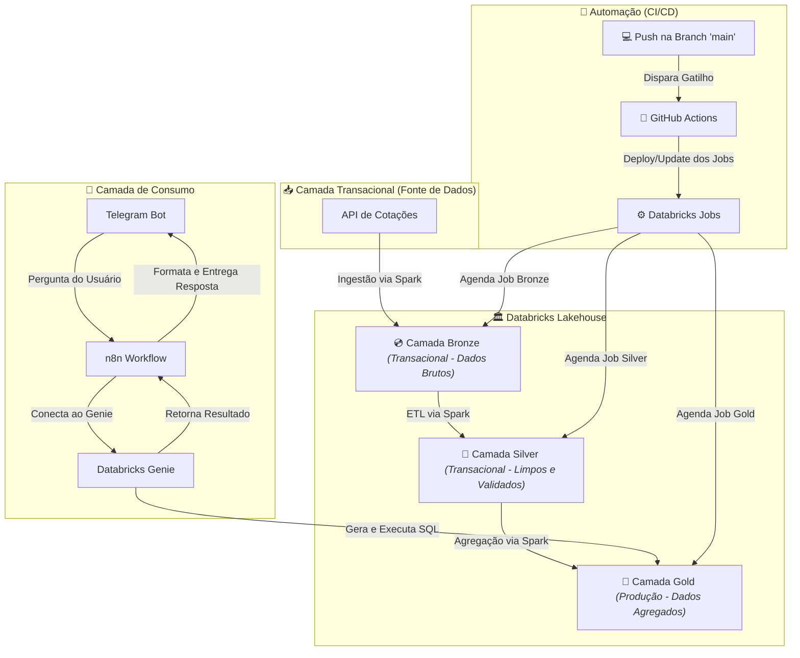

# Projeto de Pipeline de Dados e Chatbot de Cotações com Delta Lake, Spark e Telegram

## 📖 Sobre o Projeto
Este projeto demonstra a construção de um pipeline de dados robusto e uma API de consulta em linguagem natural para o mercado financeiro. A solução é capaz de ingerir, processar e servir dados de cotações de ações através de um chatbot no Telegram.

O núcleo do projeto é uma arquitetura Lakehouse construída sobre o **Delta Lake**, com um pipeline de dados totalmente gerenciado pelo **Apache Spark**, que processa informações em modo streaming e batch. Todo o ciclo de vida de desenvolvimento, deploy e agendamento de jobs é automatizado através de **CI/CD com GitHub Actions**.

## ✅ Pré-requisitos
Antes de iniciar, garanta que você tenha acesso e as configurações para as seguintes ferramentas:

- **Workspace Databricks:** Um ambiente Databricks configurado na AWS, Azure ou GCP.
- **Token de Acesso ao Databricks:** Um token de acesso pessoal para permitir que o GitHub Actions se autentique na API do Databricks.
- **Telegram Bot:** Um bot criado no Telegram com seu respectivo token de API.
- **Instância n8n:** Uma conta no n8n (Cloud ou auto-hospedada) para orquestrar o fluxo da API.
- **Conta no GitHub:** Para hospedar o repositório e utilizar o GitHub Actions.

## 🏛️ Arquitetura de Dados & Pipeline
A espinha dorsal do projeto é uma arquitetura **Medallion** implementada com Delta Lake, que organiza os dados em camadas de qualidade crescente. Isso garante governança, confiabilidade e performance. O processamento entre as camadas é orquestrado via notebooks Databricks utilizando Apache Spark.

### 📥 Transactional Camada Transacional (Fonte de Dados)

- O ponto de partida de todo o pipeline são as fontes de dados transacionais externas. Para este projeto, a fonte principal é uma API financeira que fornece dados - do mercado de ações.

- **API de Cotações:** Através de requisições a esta API, o pipeline busca dois tipos de informação:
  - **Dados Históricos:** Uma carga inicial com o histórico de cotações para um conjunto pré-definido de ativos.
  - **Cotações Atuais:** Cargas recorrentes com os dados mais recentes das cotações, permitindo que o Lakehouse se mantenha atualizado.
- **Ponto de Ingestão:** Este é o processo que alimenta a camada Bronze, trazendo os dados brutos do ambiente externo para dentro do nosso ecossistema de dados para processamento.
  
### 💿 Camada Bronze (Transacional - Dados Brutos)
-   **Propósito:** Ingestão de dados brutos de fontes externas (APIs de cotações, arquivos, etc.). Esta camada funciona como um "data swamp" persistente, armazenando os dados em seu formato original.
-   **Tecnologia:** Tabelas em formato Delta, o que permite `ACID transactions`, versionamento de dados (`time travel`) e a capacidade de misturar cargas em batch e streaming.
-   **Processamento:** O Spark é utilizado para conectar-se às fontes de dados e realizar a ingestão.

### 🥈 Camada Silver (Transacional - Dados Limpos e Validados)
-   **Propósito:** Transformar os dados brutos da camada Bronze em informações limpas, validadas e enriquecidas. Aqui ocorrem processos de deduplicação, tratamento de valores nulos, padronização de tipos de dados e joins para enriquecimento.
-   **Tecnologia:** Tabelas Delta, aproveitando a performance de `MERGE` e `UPDATE` para manter a qualidade dos dados.
-   **Processamento:** Jobs do Spark (batch ou streaming) leem os novos dados que chegam na camada Bronze e aplicam as transformações.

### 🥇 Camada Gold (Produção - Dados Agregados)
-   **Propósito:** Servir como a camada de consumo final, a "fonte da verdade" para os usuários. As tabelas aqui são agregadas e modeladas para fins específicos de negócio.
-   **Tecnologia:** Tabelas Delta, frequentemente otimizadas com `Z-ORDER` para performance máxima de consulta.
-   **Exemplos de Tabelas:** `cotacoes_medias` (médias de preço) e `cotacoes_variacoes` (variação percentual).
-   **Processamento:** Jobs do Spark em batch leem os dados da camada Silver, calculam as agregações complexas e atualizam as tabelas da camada Gold.

## 🔄 CI/CD com GitHub Actions: Infraestrutura como Código
Para garantir a integridade, automação e agilidade nas entregas, o projeto implementa um pipeline de CI/CD utilizando **GitHub Actions**.

-   **Automação Total:** O processo de deploy dos artefatos de código (notebooks, scripts) e a configuração dos jobs no Databricks são totalmente automatizados.
-   **Gatilho:** Qualquer `push` ou `merge` na branch `main` dispara o workflow do GitHub Actions.
-   **Deploy e Agendamento via JSON:** A action se autentica no workspace Databricks e utiliza um arquivo de configuração JSON presente no repositório para criar ou atualizar os jobs. Este arquivo define qual notebook executar, em qual cluster, e seu respectivo agendamento (schedule).
-   **Benefícios:** Esta abordagem de Infraestrutura como Código (IaC) garante que o ambiente de produção seja um reflexo fiel do que está versionado no Git, eliminando configurações manuais, reduzindo erros e acelerando o ciclo de desenvolvimento.

## 🤖 Camada de Consumo: Chatbot & API
A camada Gold, com seus dados de alta qualidade, serve como a base para a interface do usuário.

-   **Databricks Genie:** Atua como uma camada de tradução de linguagem natural para SQL. Ele é configurado para consultar apenas as tabelas da camada Gold.
-   **n8n:** Orquestra o fluxo da API, conectando o Telegram ao Databricks Genie, atuando como um intermediário leve entre o usuário e o poder de processamento do Databricks.

## 🚀 Como Executar o Projeto
1.  **Setup do Ambiente:** Configure o workspace no Databricks (clusters, SQL Warehouse).
2.  **Configurar CI/CD:** Adicione os `secrets` necessários (como o token de acesso ao Databricks e o host) nas configurações do repositório do GitHub para que o GitHub Actions possa se autenticar.
3.  **Definir os Jobs:** Edite o arquivo de configuração `jobs.json` (ou nome similar) no repositório para definir os notebooks a serem executados e seus respectivos agendamentos no formato `cron`.
4.  **Deploy:** Faça um push para a branch `main`. O GitHub Actions será acionado e irá automaticamente criar ou atualizar os jobs no Databricks com o agendamento definido no JSON.
5.  **Configurar Camada de Consumo:** Configure o Databricks Genie para usar as tabelas da camada Gold e, em seguida, configure o workflow no n8n para conectar o Telegram ao Genie.

## 📜 Licença
-  Este projeto está sob a licença MIT. Veja o arquivo LICENSE para mais detalhes.
  
## Resumo das Tecnologias
-   **Core do Pipeline:** Apache Spark (Structured Streaming e Batch)
-   **Armazenamento e Lakehouse:** Delta Lake
-   **Automação de CI/CD (IaC):** GitHub Actions
-   **Orquestração do Pipeline:** Databricks Jobs (gerenciados via API/JSON)
-   **Camada de IA/API:** Databricks Genie
-   **Interface do Usuário:** Telegram
-   **Orquestração da API:** n8n
